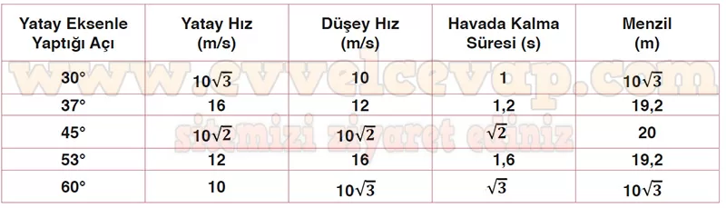

## 10. Sınıf Fizik Ders Kitabı Cevapları Meb Yayınları Sayfa 93

**1.26 Soru**

**Soru: Cirit sporunda kullanılan cirit, yatay eksenle belli bir açı oluşturacak şekilde atılır. Ciridin hareketi iki boyutlu serbest düşme hareketine örnektir. Şekildeki sporcu, ciridin yatay eksenle farklı açılar yapacak şekilde en uzak mesafeye ulaşmasını hedefleyerek ciridi 20 m/s ilk hız büyüklüğü ile fırlatmaktadır. Buna göre ciridin;**

**Soru: a) Tabloda verilen yatay eksen ile yaptığı açı değerlerini dikkate alarak yatay ve düşey hız büyüklüklerini, havada kalma süresini ve menzilini hesaplayarak tabloya yazınız.**

**Soru: b) Doldurduğunuz tablodan yola çıkarak ciridin havada kalma süresinin en uzun olması ve yatay doğrultuda en uzak mesafeye düşmesi için cirit hangi açılarla atılmalıdır?**

* **Cevap**: Havada kalma süresinin en uzun olması için 60° ve yatayda en uzak mesafeye düşmesi için 45° açı ile atılmalıdır.

**Soru: c) Başlangıçtaki hız büyüklüğü aynı olacak şekilde iki kere atılması durumunda yerde aynı noktaya düşmesi için cirit hangi açılarla atılmalıdır?**

* **Cevap**: Birbirini 90°ye tamamlayan yatay açılarla atılan cisimler yatayda eşit mesafede yol alır. Cisimlerin yerde aynı noktaya düşmesi için 37° ve 53° veya 30° ve 60° açı ile atılmaları gerekir.

**10. Sınıf Meb Yayınları Fizik Ders Kitabı Sayfa 93**