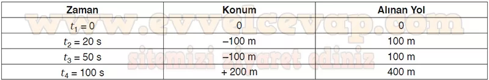
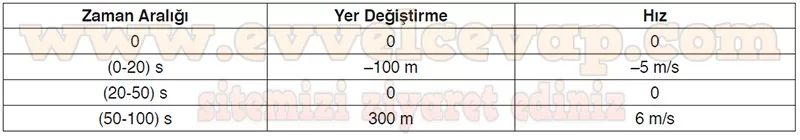

## 10. Sınıf Fizik Ders Kitabı Cevapları Meb Yayınları Sayfa 95

**1. ÜNİTE ÖLÇME VE DEĞERLENDİRME**

**Soru: Aşağıda üniteye ilişkin bilgi ve becerileri yoklayan bağlama dayalı toplam 9 soru verilmiştir. Soruların cevaplarını verilen alanlara yazınız.**

**Soru: 1) Bir mezuniyet töreninde sabit süratle hareket eden bir dron ile video ve fotoğraf çekilmektedir. Dron şekildeki gibi O noktası hizasından batı yönünde 20 s’de 100 m hareket ettirilerek A noktasında bulunan öğrencinin görüntüsünü 30 s boyunca çeker. Dron A noktasından başka bir öğrencinin görüntüsünü çekmek için doğu yönüne 50 s’de 300 m yol aldırılarak B noktasına getirilir. Buna göre;**

**Soru: a) Dronun hareketi süresince hesapladığınız konum ve alınan yol büyüklüklerini Tablo 1 ’e, yer değiştirme ve hız büyüklüklerini Tablo 2’ye yazınız.**

**Soru: b) Dronun hareketine ilişkin x-t grafiğini eksenleri verilen aşağıdaki grafik üzerinde çizerek yer değiştirmesinin, ortalama hızının ve ortalama süratinin matematiksel modelini yazınız.**

**10. Sınıf Meb Yayınları Fizik Ders Kitabı Sayfa 95**