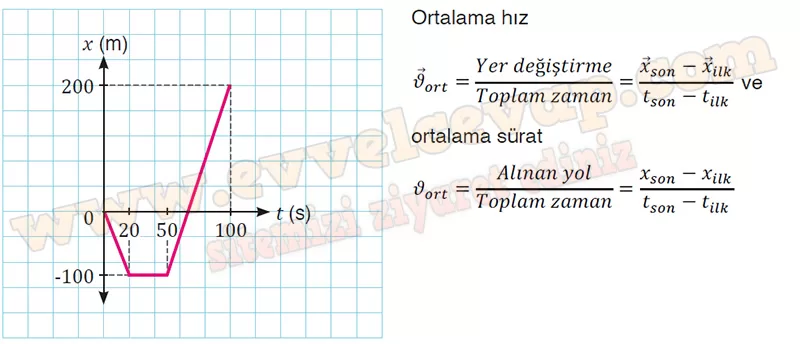
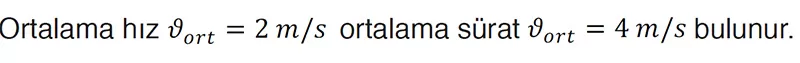
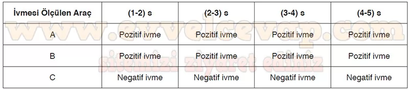
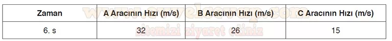

## 10. Sınıf Fizik Ders Kitabı Cevapları Meb Yayınları Sayfa 96

**Soru: c) Yazdığınız matematiksel modellerden yararlanarak dronun ortalama hızını ve ortalama süratini hesaplayınız.**

**Soru: ç) Drona ilişkin aşağıdaki genellemelerden hangisine ulaşılamaz?**

A) Yatay doğrultuda batı ve doğu yönlerindeki hızları birbirinden farklıdır.  
 B) Hareketi süresince ortalama hızı ve ortalama sürati birbirinden farklıdır.  
 C) Yatay doğrultuda aldığı yol ve yaptığı toplam yer değiştirme birbirine eşittir.  
 D) Yatay doğrultuda ve aynı yönde aldığı yol ile yaptığı yer değiştirme birbirine eşittir.  
 E) Doğrusal yol boyunca eşit zaman aralıklarında eşit yollar alması durumunda hızı sabittir.

**Soru: 2) Polis Akademisi uygulama öğrencileri, otoyolda hız kontrolü yapmaktadır. Öğrenciler aynı yönde hareket eden üç farklı aracın her 1 s’deki hızlarını kaydederek aşağıdaki tabloyu elde ederler. Araçların hareket yönleri pozitif olarak seçilmiştir. Araçların sabit ivme ile hareket ettiği bilindiğine göre tablodan yararlanarak aşağıdaki soruları cevaplayınız.**

**Soru: a) Aşağıdaki tabloda verilen zaman aralıkları için A, B ve C araçlarının ivmeleri pozitif ise “pozitif ivme” negatif ise “negatif ivme” yazınız.**

**Soru: b) Araçların 6. s’deki hızlarını tahmin ederek yazınız.**

**10. Sınıf Meb Yayınları Fizik Ders Kitabı Sayfa 96**