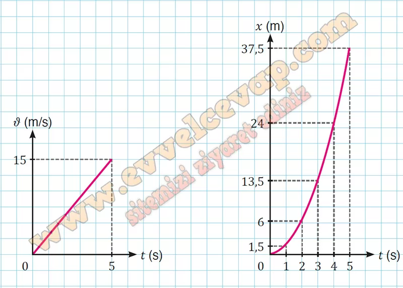
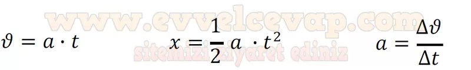

## 10. Sınıf Fizik Ders Kitabı Cevapları Meb Yayınları Sayfa 98

**Soru: b) A sporcusunun hareket grafiklerinden yararlanarak B sporcusuna ait a-t grafiğini &-t ve x-t grafiğine dönüştürünüz.**

**Soru: c) A ve B sporcularının hareket grafiklerini doğrulayan hız, yer değiştirme ve ivme kavramlarına yönelik matematiksel modelleri yazınız.**

**Soru: ç) Yatay doğrultuda sabit ivmeli harekete ait grafikler ve matematiksel modeller arasındaki ilişkiyi kendi cümlelerinizle ifade ediniz.**

* **Cevap**: Sabit ivmeli harekette kullanılan matematiksel modeller hareket grafiklerinden yararlanılarak elde edilmiştir. Hız-zaman grafiğinde birim zamandaki hız değişimi oranı veya grafiğin eğimi ivmeyi verir. Sabit ivmeli harekete ait ivme-zaman grafiğinde herhangi bir t ile ivmenin çarpımı ilk hızı sıfır olan hareketlinin t anındaki hızını verir. Benzer şekilde herhangi bir t anında grafiğin yatay eksen ile arasında kalan alan hareketlini

**Soru: Nilay öğretmen, öğrencilerine hava direncinin ihmal edildiği bir ortamda kütleleri sırasıyla m ve 2m olan iki cismin serbest düşme hareketini yavaş çekimde gösteren videoları izletir. Bu videolarda şekildeki gibi ilk hızının büyüklüğü 20 m/s olan A cisminin ve ilk hızı sıfır olan B cisminin belirli bir yükseklikten serbest bırakıldığı gözlemlenir. Öğrenciler videoları inceler ve her 1 s sonunda cisimlerin hız ve yer değiştirme büyüklüklerini kaydederek aşağıdaki tabloyu doldururlar.**

* **Cevap**: **Bu etkinliğin cevabı diğer sayfadadır. (Bkz. sayfa 99)**

**10. Sınıf Meb Yayınları Fizik Ders Kitabı Sayfa 98**