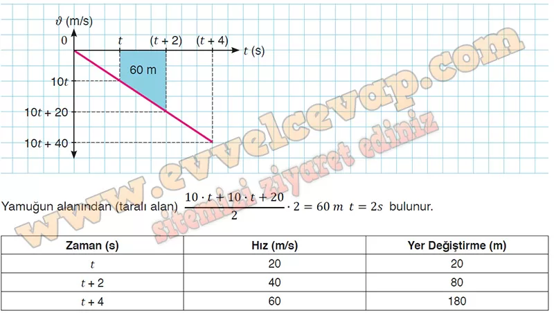

## 10. Sınıf Fizik Ders Kitabı Cevapları Meb Yayınları Sayfa 99

**Soru: Buna göre tablodaki verilerden yararlanarak A ve B cisimlerinin;**

**Soru: a) Hızlarındaki değişimler ile ivmeleri arasındaki ilişkiyi yorumlayınız.**

* **Cevap**: A ve B cisimlerinin hız büyüklükleri her bir saniyede 10 m/s artmıştır. Buna göre cisimlerin sahip olduğu ivme büyüklükleri 10 m/s2dir. Cisimlerin hareketi kütlelerinden bağımsızdır.

**Soru: b) Hareket ettiği ortamın yer çekimi ivmesinin büyüklüğü nedir?**

**Soru: c) Serbest düşme hareketi ile ilgili aşağıda verilen** I. Cisimlerin hızları her 1 s’de 10 m/s artmıştır.  
 II. Cisimler her bir zaman aralığında eşit yer değiştirmeler yapar.  
 III. Cisimlerin yer değiştirme büyüklükleri zamanın karesiyle orantılı olarak artar.  
 IV. Cisimlerin hız değişimleri kütlelerinden bağımsızdır.  
 V. Kütleleri eşit olan cisimlerin yer değiştirme büyüklükleri de eşit olur, **genellemelerinden hangileri doğrudur?**

**Soru: 5) Fizik dersinde öğrencilere serbest düşen cisimlerle ilgili havası boşaltılmış ortamda yapılan bir deneyin videosu izletilir. Bu videoda şekilde gösterildiği gibi tenis topunun belli bir yükseklikten serbest bırakıldığı gösterilir. Serbest bırakılan tenis topu; şekildeki gibi t süre sonra K noktasına ulaşmakta, 60 m olan K ve L arasını 2 s’de geçmekte ve L noktasından geçtikten 2 s sonra da yere çarpmaktadır. Yer çekimi ivmesinin büyüklüğü g = 10 m/s2 olarak kabul edildiğine göre;**

**Soru: a) Tenis topunun hareketi ile ilgili verileri kullanarak ν-t grafiğini çizip tabloyu doldurunuz.**

**10. Sınıf Meb Yayınları Fizik Ders Kitabı Sayfa 99**