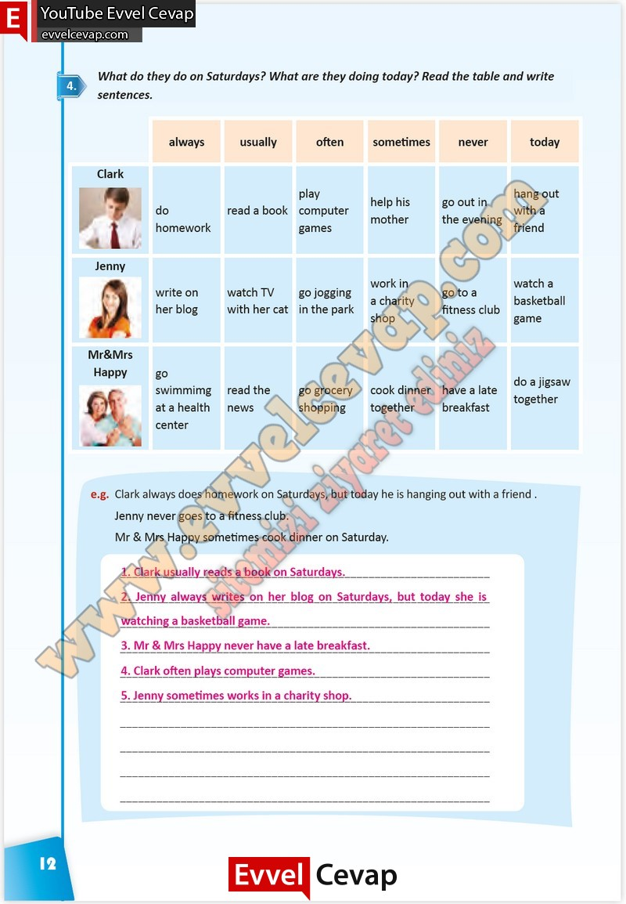

## 10. Sınıf İngilizce Çalışma Kitabı Cevapları Pasifik Yayınları Sayfa 12

**Soru: What do they do on Saturdays? What are they doing today? Read the table and write sentences.**

**10. Sınıf Pasifik Yayınları İngilizce Çalışma Kitabı Sayfa 12**