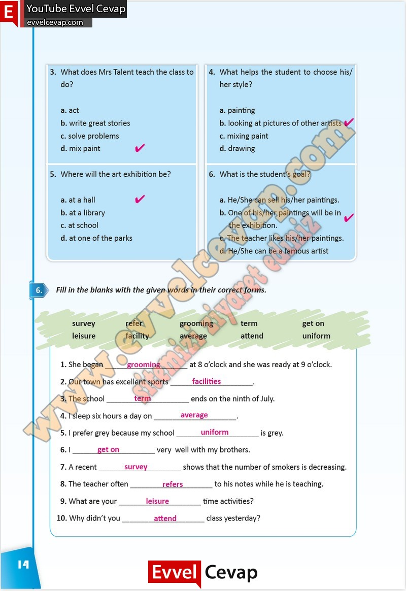

## 10. Sınıf İngilizce Çalışma Kitabı Cevapları Pasifik Yayınları Sayfa 14

**Soru: What does Mrs Talent teach the class to do?**

a. act  
 b. write great stories  
 c. solve problems  
 d. mix paint

**Soru: What helps the student to choose his/ her style?**

a. painting  
 b. looking at pictures of other artists  
 c. mixing paint  
 d. drawing

**Soru: Where will the art exhibition be?**

a. at a hall  
 b. at a library  
 c. at school  
 d. at one of the parks

**Soru: What is the student’s goal?**

a. He/She can sell his/her paintings.  
 b. One of his/her paintings will be in the exhibition.  
 c. The teacher likes his/her paintings.  
 d. He/She can be a famous artist

**Soru: Fill in the blanks with the given words in their correct forms.**

**10. Sınıf Pasifik Yayınları İngilizce Çalışma Kitabı Sayfa 14**