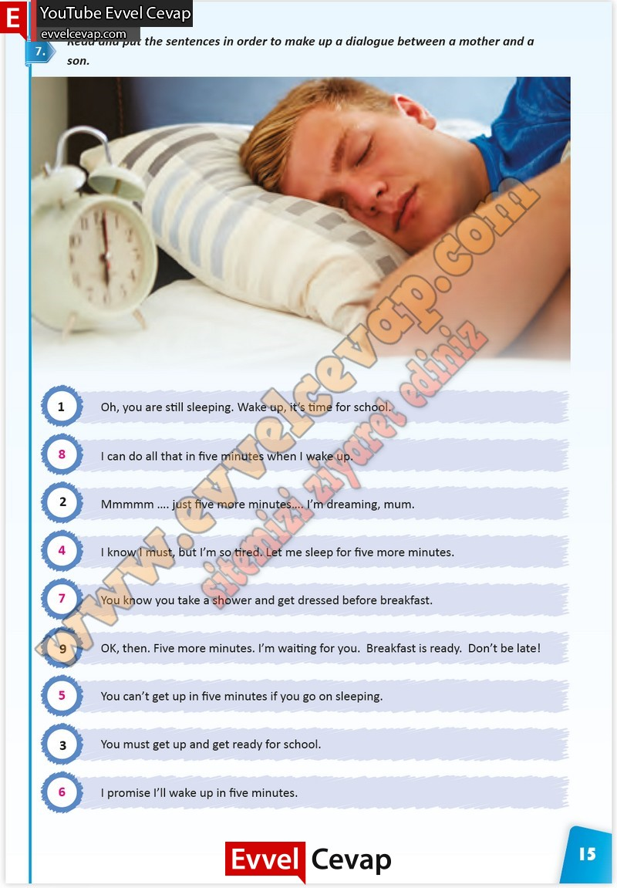

## 10. Sınıf İngilizce Çalışma Kitabı Cevapları Pasifik Yayınları Sayfa 15

**Soru: Read and put the sentences in order to make up a dialogue between a mother and a son.**

**10. Sınıf Pasifik Yayınları İngilizce Çalışma Kitabı Sayfa 15**