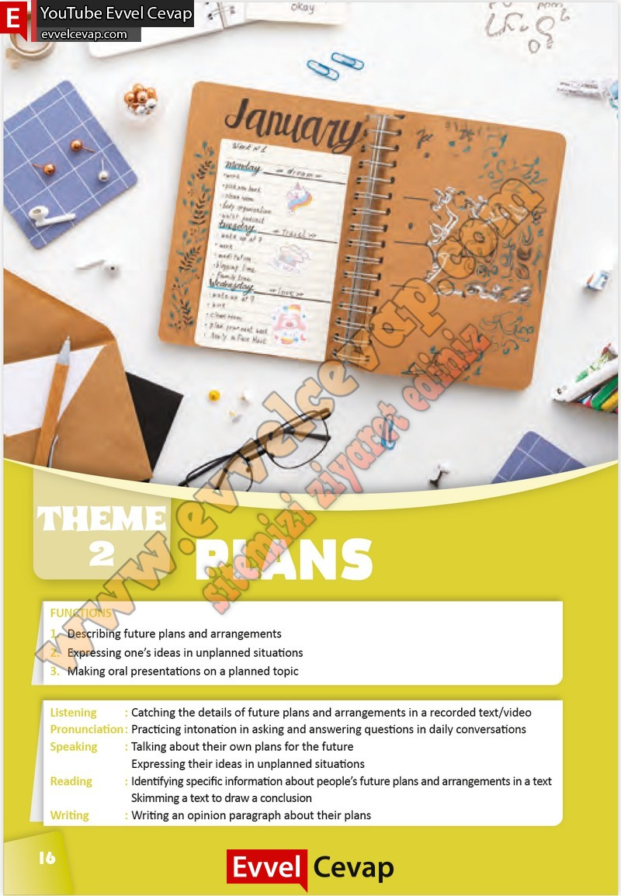

## 10. Sınıf İngilizce Çalışma Kitabı Cevapları Pasifik Yayınları Sayfa 16

1. Describing future plans and arrangements  
 2. Expressing one’s ideas in unplanned situations  
 3. Making oral presentations on a planned topic  
 Listening : Catching the details of future plans and arrangements in a recorded text/video  
 Pronunciation : Practicing intonation in asking and answering questions in daily conversations  
 Speaking : Talking about their own plans for the future  
 Expressing their ideas in unplanned situations  
 Reading : Identifying specific information about people’s future plans and arrangements in a text  
 Skimming a text to draw a conclusion  
 Writing : Writing an opinion paragraph about their plans

**10. Sınıf Pasifik Yayınları İngilizce Çalışma Kitabı Sayfa 16**