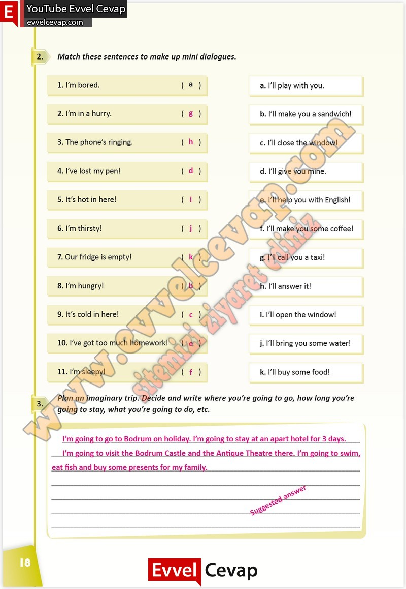

## 10. Sınıf İngilizce Çalışma Kitabı Cevapları Pasifik Yayınları Sayfa 18

**Soru: Match these sentences to make up mini dialogues.**

**Soru: Plan an imaginary trip. Decide and write where you’re going to go, how long you’re going to stay, what you’re going to do, etc.**

**10. Sınıf Pasifik Yayınları İngilizce Çalışma Kitabı Sayfa 18**