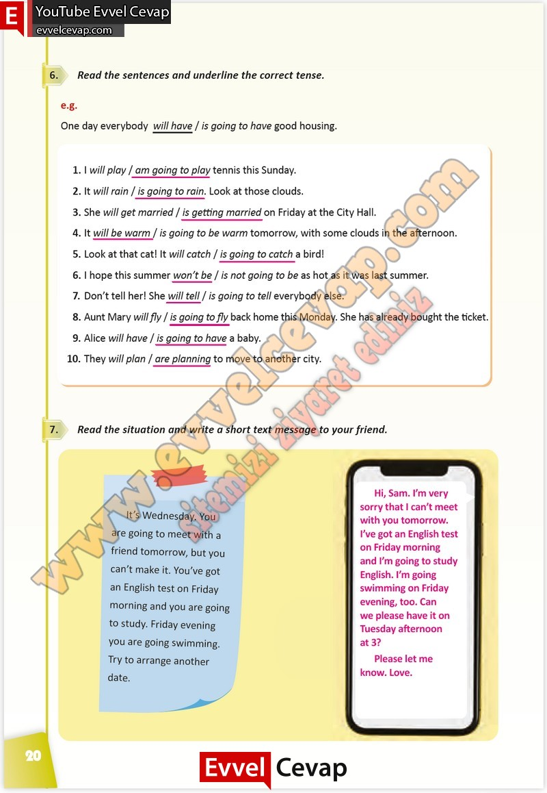

## 10. Sınıf İngilizce Çalışma Kitabı Cevapları Pasifik Yayınları Sayfa 20

**Soru: Read the sentences and underline the correct tense.**

1. I will play / am going to play tennis this Sunday.  
 2. It will rain / is going to rain. Look at those clouds.  
 3. She will get married / is getting married on Friday at the City Hall.  
 4. It will be warm / is going to be warm tomorrow, with some clouds in the afternoon.  
 5. Look at that cat! It will catch / is going to catch a bird!  
 6. I hope this summer won’t be / is not going to be as hot as it was last summer.  
 7. Don’t tell her! She will tell / is going to tell everybody else.  
 8. Aunt Mary will fly / is going to fly back home this Monday. She has already bought the ticket.  
 9. Alice will have / is going to have a baby.  
 10. They will plan / are planning to move to another city.

**Soru: Read the situation and write a short text message to your friend.**

**10. Sınıf Pasifik Yayınları İngilizce Çalışma Kitabı Sayfa 20**