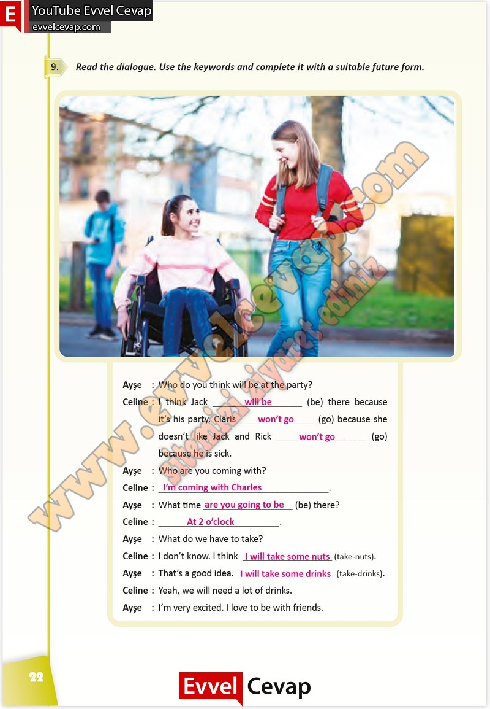

## 10. Sınıf İngilizce Çalışma Kitabı Cevapları Pasifik Yayınları Sayfa 22

**Soru: Read the dialogue. Use the keywords and complete it with a suitable future form.**

**10. Sınıf Pasifik Yayınları İngilizce Çalışma Kitabı Sayfa 22**