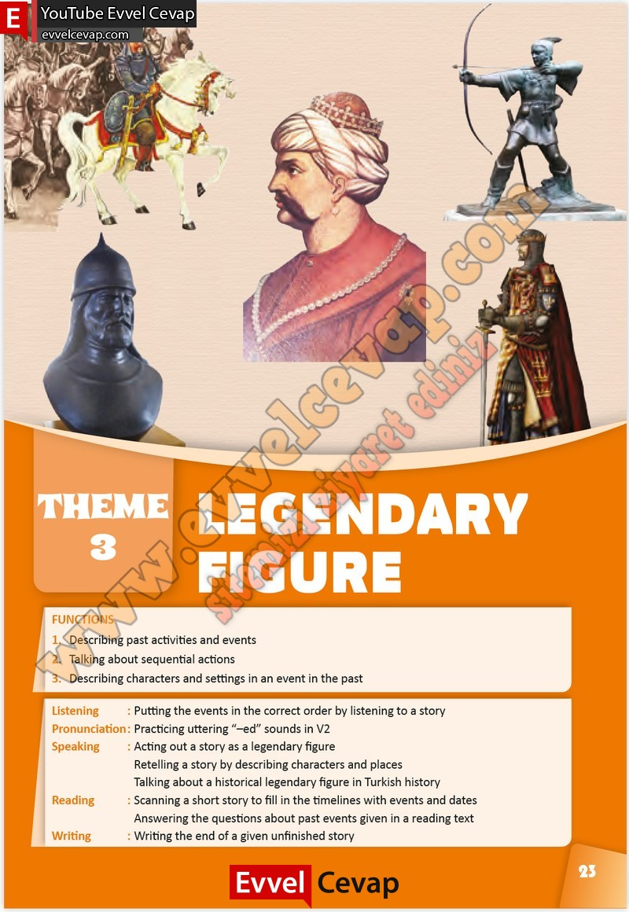

## 10. Sınıf İngilizce Çalışma Kitabı Cevapları Pasifik Yayınları Sayfa 23

FUNCTIONS  
 1. Describing past activities and events  
 2. Talking about sequential actions  
 3. Describing characters and settings in an event in the past  
 Listening : Putting the events in the correct order by listening to a story  
 Pronunciation : Practicing uttering “–ed” sounds in V2  
 Speaking : Acting out a story as a legendary figure  
 Retelling a story by describing characters and places  
 Talking about a historical legendary figure in Turkish history  
 Reading : Scanning a short story to fill in the timelines with events and dates  
 Answering the questions about past events given in a reading text  
 Writing : Writing the end of a given unfinished story

**10. Sınıf Pasifik Yayınları İngilizce Çalışma Kitabı Sayfa 23**