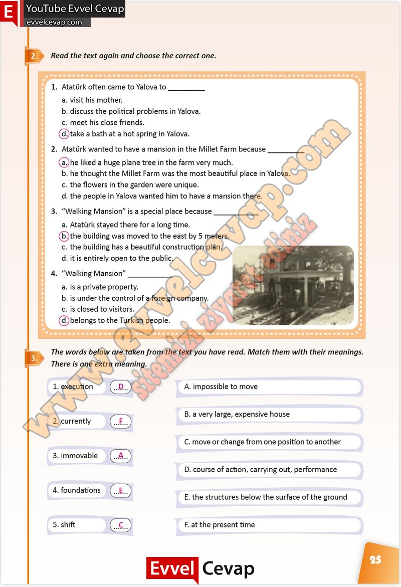

## 10. Sınıf İngilizce Çalışma Kitabı Cevapları Pasifik Yayınları Sayfa 25

**Soru: Read the text again and choose the correct one.**

**Soru: Atatürk often came to Yalova to \_**

a. visit his mother.  
 b. discuss the political problems in Yalova.  
 c. meet his close friends.  
 d. take a bath at a hot spring in Yalova.

**Soru: Atatürk wanted to have a mansion in the Millet Farm because \_**

a. he liked a huge plane tree in the farm very much.  
 b. he thought the Millet Farm was the most beautiful place in Yalova.  
 c. the flowers in the garden were unique.  
 d. the people in Yalova wanted him to have a mansion there.

**Soru: Walking Mansion” is a special place because \_**

a. Atatürk stayed there for a long time.  
 b. the building was moved to the east by 5 meters.  
 c. the building has a beautiful construction plan.  
 d. it is entirely open to the public.

**Soru: Walking Mansion” \_**

a. is a private property.  
 b. is under the control of a foreign company.  
 c. is closed to visitors.  
 d. belongs to the Turkish people.

**Soru: The words below are taken from the text you have read. Match them with their meanings. There is one extra meaning.**

**10. Sınıf Pasifik Yayınları İngilizce Çalışma Kitabı Sayfa 25**