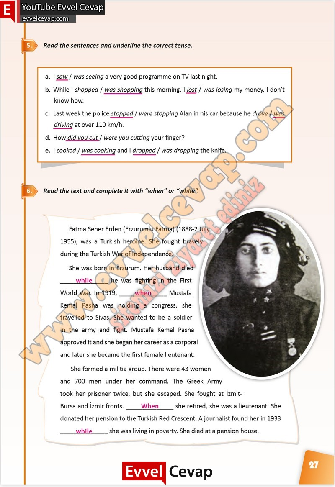

## 10. Sınıf İngilizce Çalışma Kitabı Cevapları Pasifik Yayınları Sayfa 27

**Soru: Read the sentences and underline the correct tense.**

**Soru: Read the text and complete it with “when” or “vvhile”.**

**10. Sınıf Pasifik Yayınları İngilizce Çalışma Kitabı Sayfa 27**