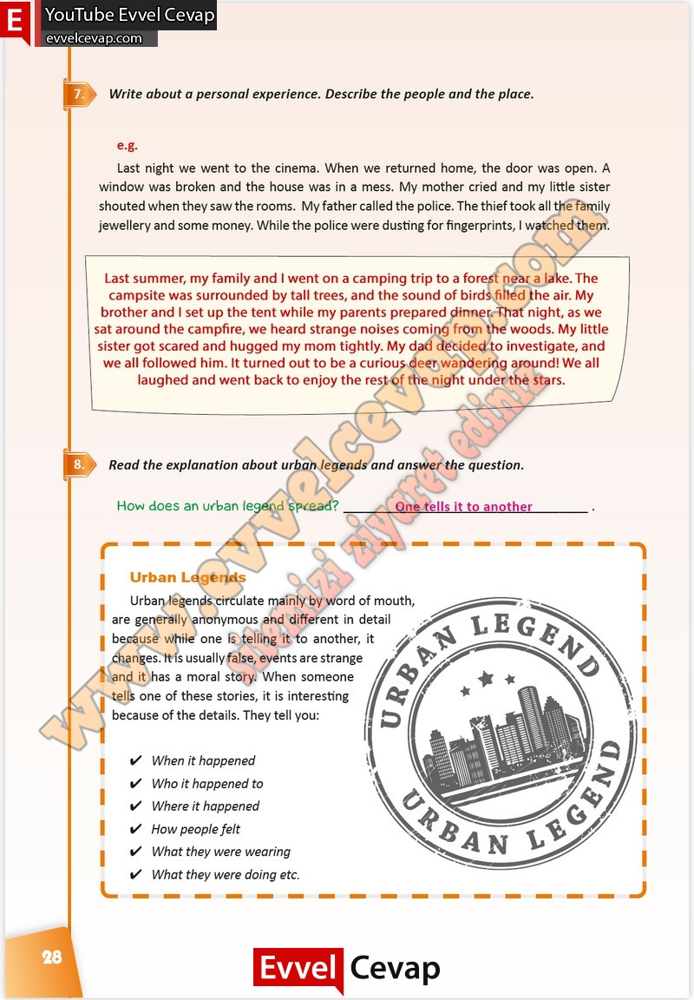

## 10. Sınıf İngilizce Çalışma Kitabı Cevapları Pasifik Yayınları Sayfa 28

**Soru: Write about a personal experience. Describe the people and the plac e.**

**Soru: Read the explanation about urban legends and answer the question.**

**10. Sınıf Pasifik Yayınları İngilizce Çalışma Kitabı Sayfa 28**