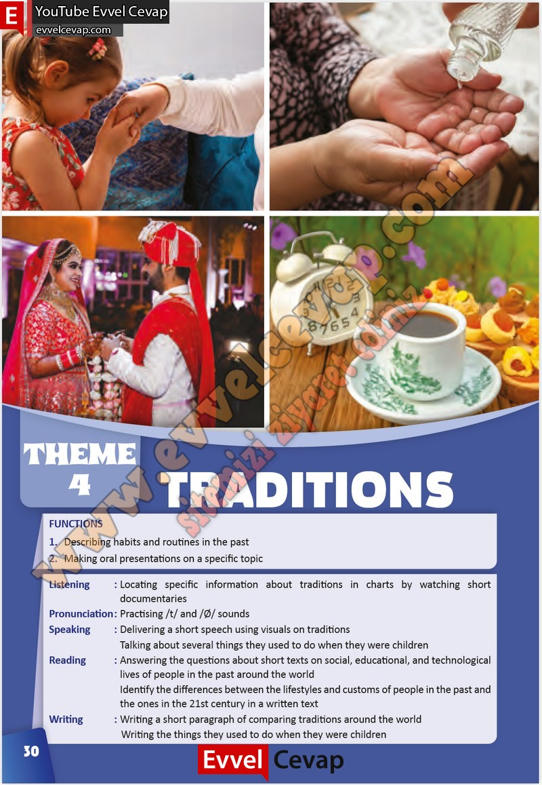

## 10. Sınıf İngilizce Çalışma Kitabı Cevapları Pasifik Yayınları Sayfa 30

Locating specific information about traditions in charts by watching short  
 documentaries  
 Practising /t/ and /0/ sounds  
 Delivering a short speech using visuals on traditions  
 Talking about several things they used to do when they were children  
 Ansvvering the questions about short texts on social, educational, and technological  
 lives of people in the past around the world  
 Identify the differences between the lifestyles and customs of people in the past and  
 the ones in the 21st century in a vvritten text  
 VVriting a short paragraph of comparing traditions around the world  
 Writing the things they used to do when they were children

**10. Sınıf Pasifik Yayınları İngilizce Çalışma Kitabı Sayfa 30**