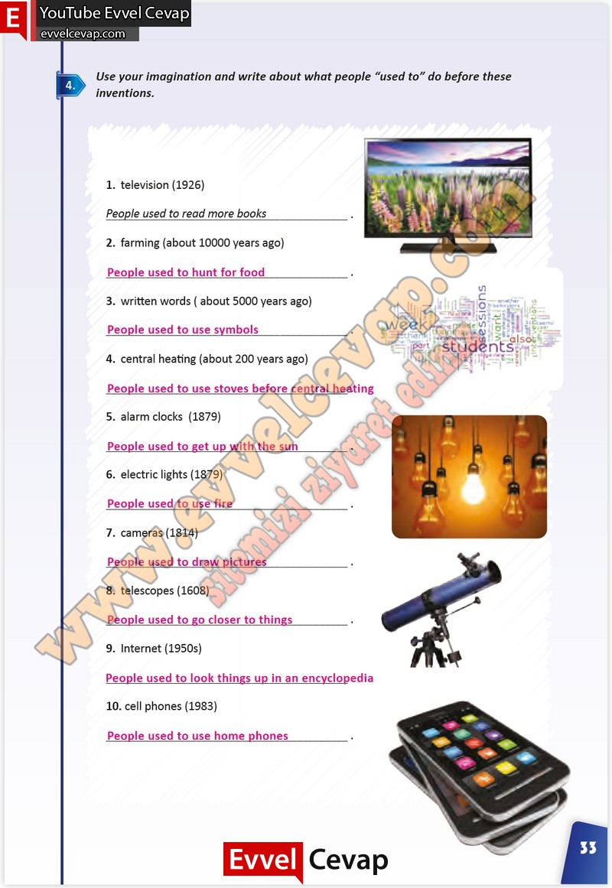

## 10. Sınıf İngilizce Çalışma Kitabı Cevapları Pasifik Yayınları Sayfa 33

**Soru: Use your imagination and write about what people “used to” do before these inventions.**

**10. Sınıf Pasifik Yayınları İngilizce Çalışma Kitabı Sayfa 33**