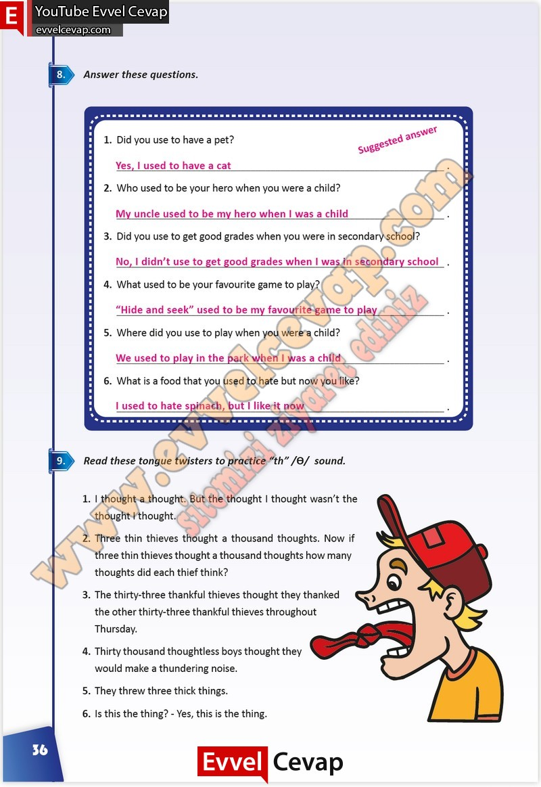

## 10. Sınıf İngilizce Çalışma Kitabı Cevapları Pasifik Yayınları Sayfa 36

**Soru: Answer these questions.**

**Soru: Did you use to have a pet?**

**Soru: Who used to be your hero when you were a child?**

**Soru: Did you use to get good grades when you were in secondary school?**

**Soru: What used to be your favourite game to play?**

**Soru: Where did you use to play when you were a child?**

**Soru: What is a food that you used to hate but now you like?**

**Soru: Read these tongue twisters to practice “th” /Ɵ/ sound.**

**10. Sınıf Pasifik Yayınları İngilizce Çalışma Kitabı Sayfa 36**