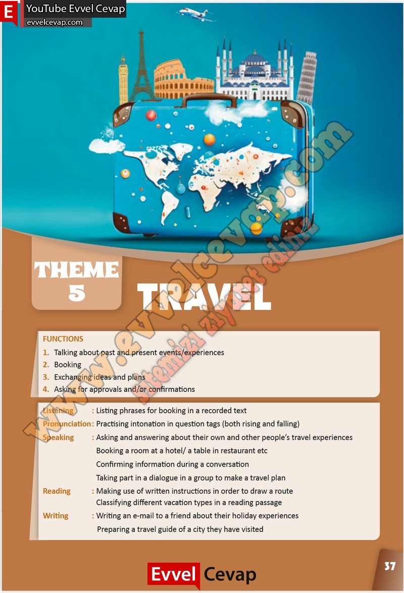

## 10. Sınıf İngilizce Çalışma Kitabı Cevapları Pasifik Yayınları Sayfa 37

FUNCTIONS  
 1. Talking about past and present events/experiences  
 2. Booking  
 3. Exchanging ideas and plans  
 4. Asking for approvals and/or confirmations  
 Listening : Listing phrases for booking in a recorded text  
 Pronunciation : Practising intonation in question tags (both rising and falling)  
 Speaking : Asking and answering about their own and other people’s travel experiences  
 Booking a room at a hotel/ a table in restaurant etc  
 Confirming information during a conversation  
 Taking part in a dialogue in a group to make a travel plan  
 Reading : Making use of written instructions in order to draw a route  
 Classifying different vacation types in a reading passage  
 Writing : Writing an e-mail to a friend about their holiday experiences  
 Preparing a travel guide of a city they have visited

**10. Sınıf Pasifik Yayınları İngilizce Çalışma Kitabı Sayfa 37**