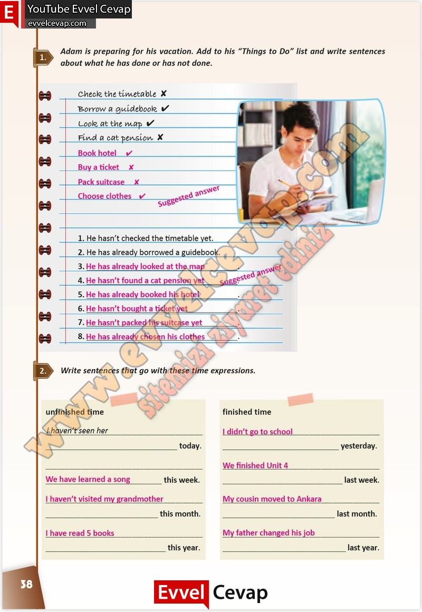

## 10. Sınıf İngilizce Çalışma Kitabı Cevapları Pasifik Yayınları Sayfa 38

**Soru: Adam is preparing for his vacation. Add to his “Things to Do” list and write sentences about what he has done or has not done.**

**Soru: Write sentences that go with these time expressions.**

**10. Sınıf Pasifik Yayınları İngilizce Çalışma Kitabı Sayfa 38**