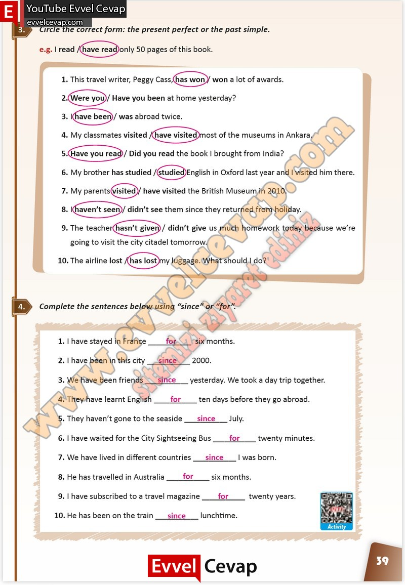

## 10. Sınıf İngilizce Çalışma Kitabı Cevapları Pasifik Yayınları Sayfa 39

**Soru: Circle the correct form: the present perfect or the past simple.**

**Soru: Complete the sentences below using “since” or “for”.**

**10. Sınıf Pasifik Yayınları İngilizce Çalışma Kitabı Sayfa 39**