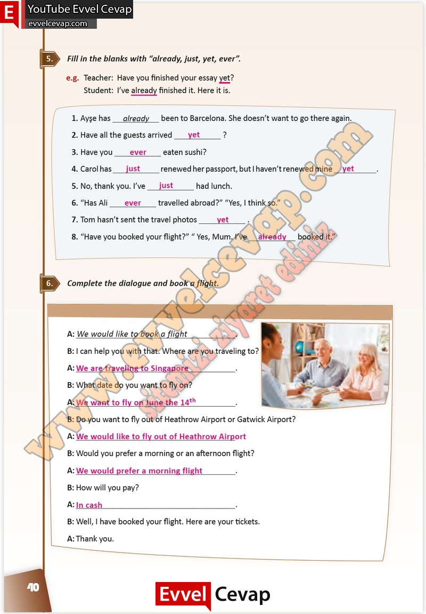

## 10. Sınıf İngilizce Çalışma Kitabı Cevapları Pasifik Yayınları Sayfa 40

**Soru: Fiil in the blanks with “already, just, yet, ever’’**

**Soru: Complete the dialogue and book a flight.**

**Soru: I can help you with that. Where are you traveling to?**

**Soru: What date do you want to fly on?**

**Soru: Do you want to fly out of Heathrow Airport or Gatwick Airport?**

**Soru: Would you prefer a morning or an afternoon flight?**

**Soru: How will you pay?**

**10. Sınıf Pasifik Yayınları İngilizce Çalışma Kitabı Sayfa 40**