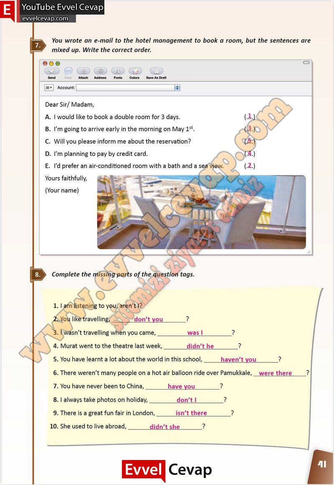

## 10. Sınıf İngilizce Çalışma Kitabı Cevapları Pasifik Yayınları Sayfa 41

**Soru: You wrote an e-mail to the hotel management to book a room, but the sentences are mixed up. Write the correct order.**

**Soru: Complete the missing parts of the question tags.**

**10. Sınıf Pasifik Yayınları İngilizce Çalışma Kitabı Sayfa 41**