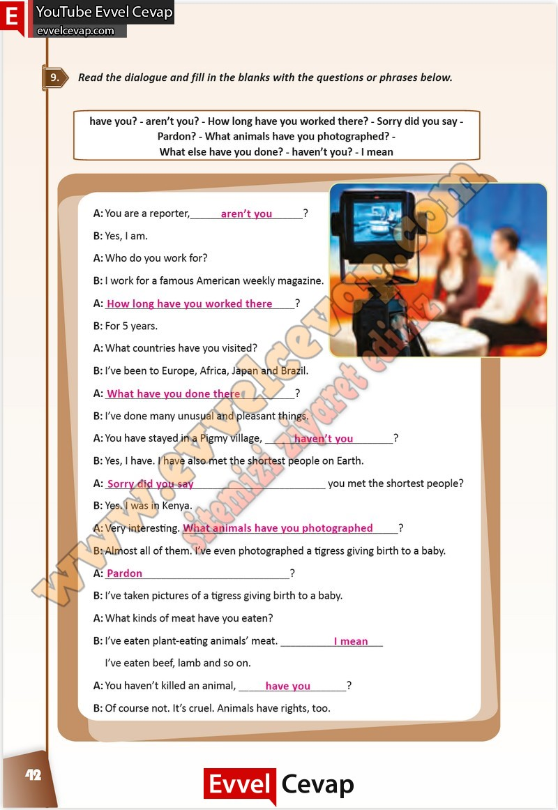

## 10. Sınıf İngilizce Çalışma Kitabı Cevapları Pasifik Yayınları Sayfa 42

**Soru: Read the dialogue and fill in the blanks with the questions or phrases below.**

**10. Sınıf Pasifik Yayınları İngilizce Çalışma Kitabı Sayfa 42**