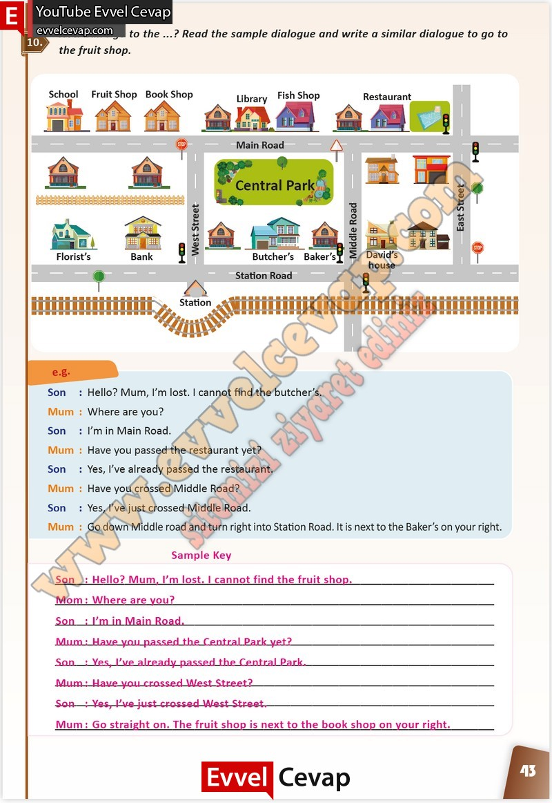

## 10. Sınıf İngilizce Çalışma Kitabı Cevapları Pasifik Yayınları Sayfa 43

**Soru: How can I go to the…? Read the sample dialogue and write a similar dialogue to go to the fruit shop.**

**10. Sınıf Pasifik Yayınları İngilizce Çalışma Kitabı Sayfa 43**