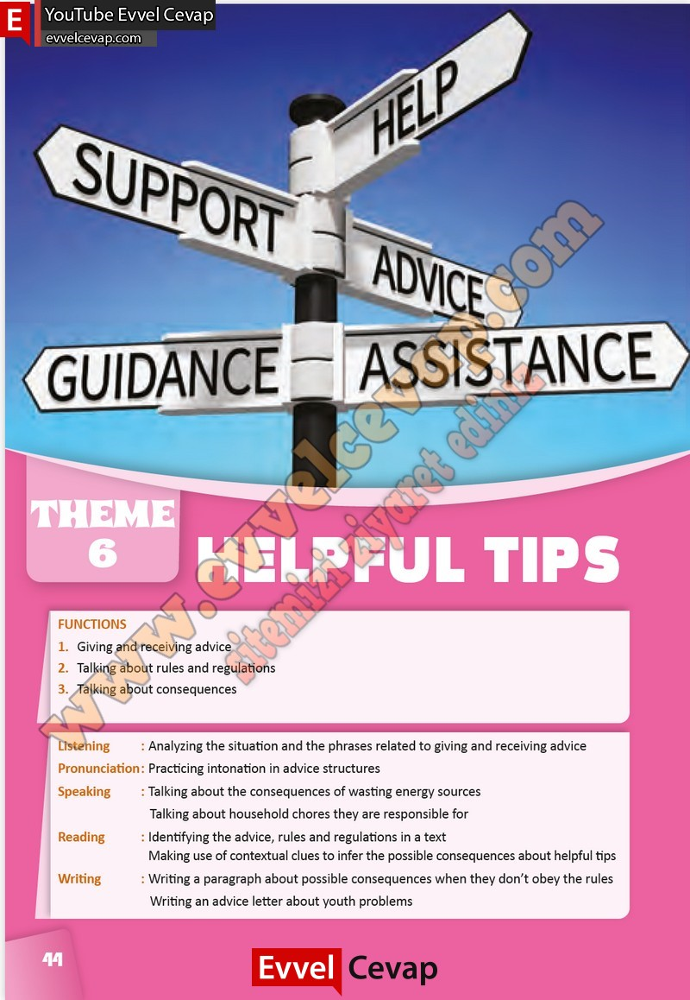

## 10. Sınıf İngilizce Çalışma Kitabı Cevapları Pasifik Yayınları Sayfa 44

FUNCTIONS  
 1. Giving and receiving advice  
 2. Talking about rules and regulations  
 3. Talking about consequences  
 Listening : Analyzing the situation and the phrases related to giving and receiving advice  
 Pronunciation : Practicing intonation in advice structures  
 Speaking : Talking about the consequences of wasting energy sources  
 Talking about household chores they are responsible for  
 Reading : Identifying the advice, rules and regulations in a text  
 Making use of contextual clues to infer the possible consequences about helpful tips  
 Writing : Writing a paragraph about possible consequences when they don’t obey the rules  
 Writing an advice letter about youth problems

**10. Sınıf Pasifik Yayınları İngilizce Çalışma Kitabı Sayfa 44**