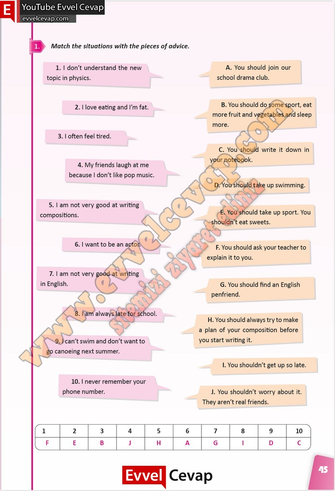

## 10. Sınıf İngilizce Çalışma Kitabı Cevapları Pasifik Yayınları Sayfa 45

**Soru: Match the situations with the pieces of advice.**

**10. Sınıf Pasifik Yayınları İngilizce Çalışma Kitabı Sayfa 45**