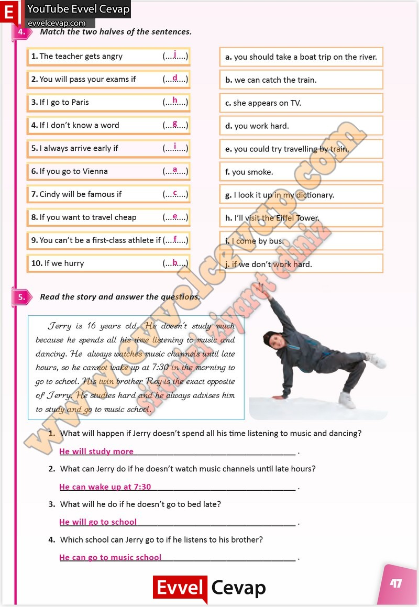

## 10. Sınıf İngilizce Çalışma Kitabı Cevapları Pasifik Yayınları Sayfa 47

**Soru: Match the two halves of the sentences.**

**Soru: Read the story and answer the questions.**

**Soru: What will happen if Jerry doesn’t spend all his time listening to music and dancing?**

**Soru: What can Jerry do if he doesn’t watch music channels until late hours?**

**Soru: What will he do if he doesn’t go to bed late?**

**Soru: Which school can Jerry go to if he listens to his brother?**

**10. Sınıf Pasifik Yayınları İngilizce Çalışma Kitabı Sayfa 47**