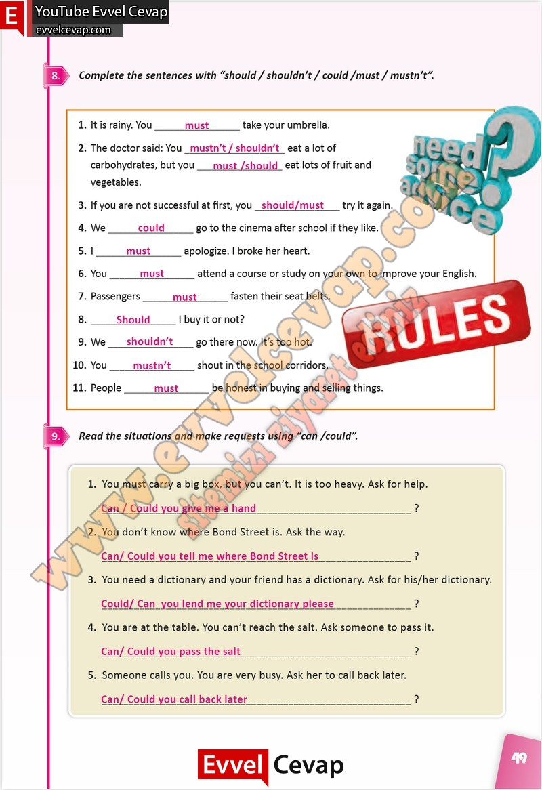

## 10. Sınıf İngilizce Çalışma Kitabı Cevapları Pasifik Yayınları Sayfa 49

**Soru: Complete the sentences with “should / shouldn’t/ could /must/ mustn’t’**

**Soru: Read the situations and make requests using “can /could’**

**10. Sınıf Pasifik Yayınları İngilizce Çalışma Kitabı Sayfa 49**