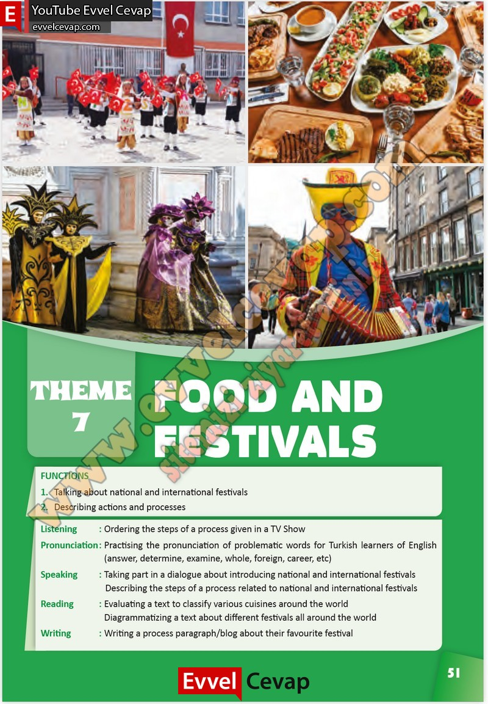

## 10. Sınıf İngilizce Çalışma Kitabı Cevapları Pasifik Yayınları Sayfa 51

FUNCTIONS  
 1. Talking about national and International festi vals  
 2. Describing actions and processes  
 Listening : Ordering the steps of a process given in a TV Show  
 Pronunciation: Practising the pronunciation of problematic words for Turkish learners of English (ansvver, determine, examine, whole, foreign, career, ete)  
 Speaking : Taking part in a dialogue about introducing national and International festivals Describing the steps of a process related to national and international festivals  
 Reading : Evaluating a text to elassify various cuisines around the world  
 Diagrammatizing a text about different festivals ali around the world  
 Writing : Writing a process paragraph/blog about their favourite festival

**10. Sınıf Pasifik Yayınları İngilizce Çalışma Kitabı Sayfa 51**