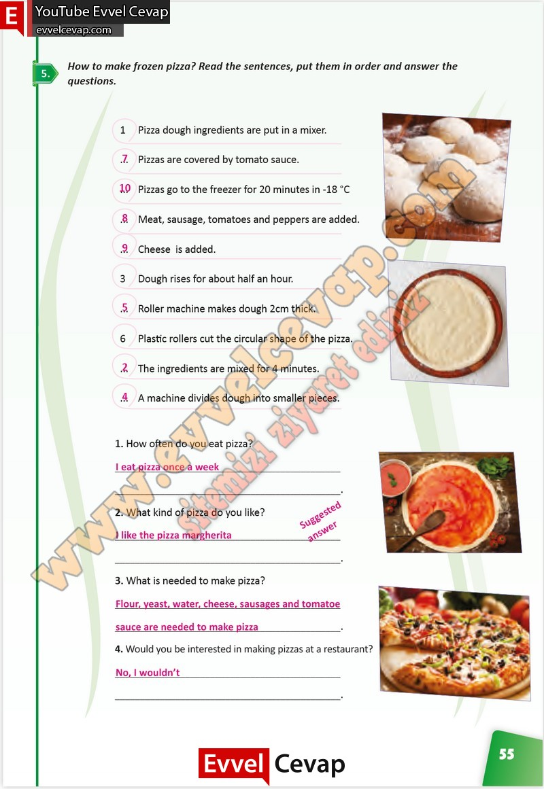

## 10. Sınıf İngilizce Çalışma Kitabı Cevapları Pasifik Yayınları Sayfa 55

**Soru: How to make frozen pizza? Read the sentences, put them in order and answer the questions.**

**Soru: How often do you eat pizza?**

**Soru: What kind of pizza do you like?**

**Soru: What is needed to make pizza?**

**Soru: Would you be interested in making pizzas at a restaurant?**

**10. Sınıf Pasifik Yayınları İngilizce Çalışma Kitabı Sayfa 55**