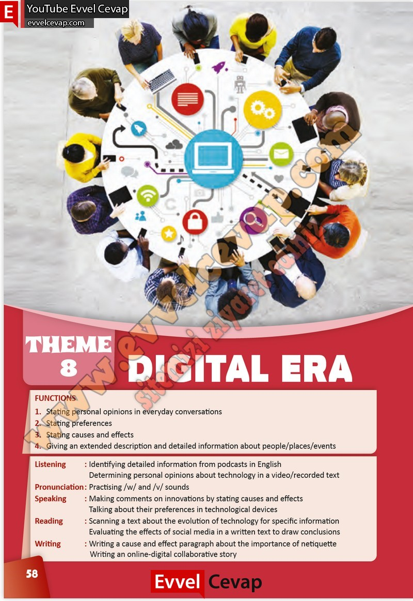

## 10. Sınıf İngilizce Çalışma Kitabı Cevapları Pasifik Yayınları Sayfa 58

1. Stating personal opinions in everyday conversations  
 2. Stating preferences  
 3. Stating causes and effects  
 4. Giving an extended description and detailed information about people/places/events  
 Listening : Identifying detailed information from podcasts in English  
 Determining personal opinions about technology in a video/recorded text  
 Pronunciation : Practising /w/ and /v/ sounds  
 Speaking : Making comments on innovations by stating causes and effects  
 Talking about their preferences in technological devices  
 Reading : Scanning a text about the evolution of technology for specific information  
 Evaluating the effects of social media in a written text to draw conclusions  
 Writing : Writing a cause and effect paragraph about the importance of netiquette  
 Writing an online-digital collaborative story

**10. Sınıf Pasifik Yayınları İngilizce Çalışma Kitabı Sayfa 58**