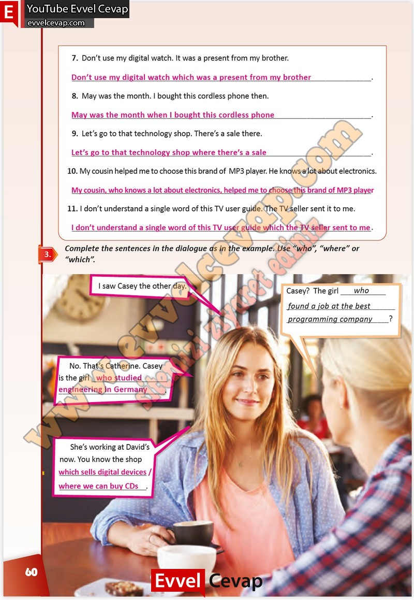

## 10. Sınıf İngilizce Çalışma Kitabı Cevapları Pasifik Yayınları Sayfa 60

7. Don’t use my digital watch. It was a present from my brother.  
 8. May was the month. I bought this cordless phone then.  
 9. Let’s go to that technology shop. There’s a sale there.  
 10. My cousin helped me to choose this brand of MP3 player. He knows a lot about electronics.  
 11. I don’t understand a single word of this TV user guide. The TV seller sent it to me.

**Soru: Complete the sentences in the dialogue as in the e xample. Use “who”, “where” or “which”.**

**10. Sınıf Pasifik Yayınları İngilizce Çalışma Kitabı Sayfa 60**