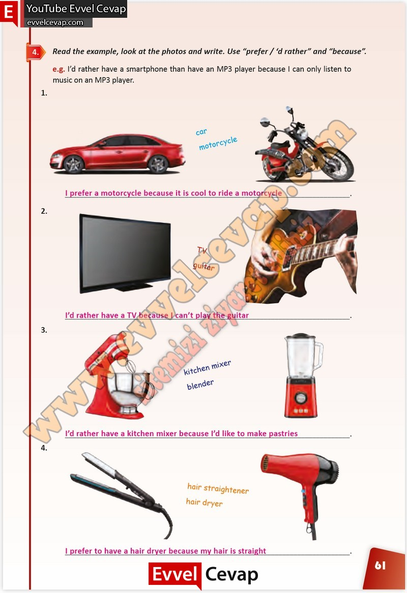

## 10. Sınıf İngilizce Çalışma Kitabı Cevapları Pasifik Yayınları Sayfa 61

**Soru: Read the example, look at the photos and write. Use “prefer / ‘d rather” and “because”.**

**10. Sınıf Pasifik Yayınları İngilizce Çalışma Kitabı Sayfa 61**