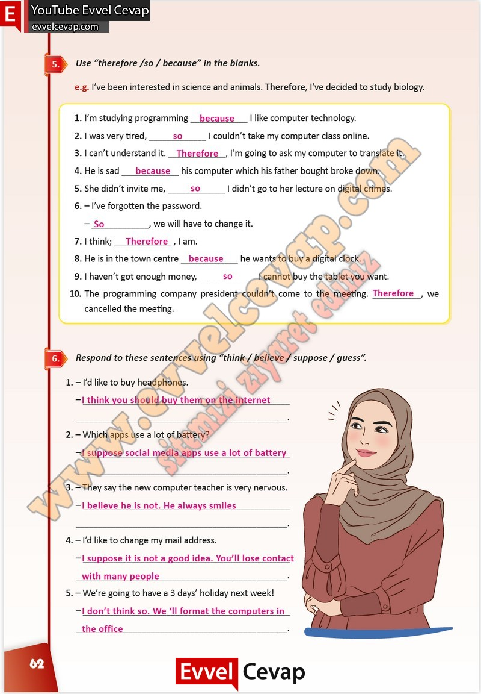

## 10. Sınıf İngilizce Çalışma Kitabı Cevapları Pasifik Yayınları Sayfa 62

**Soru: Use “therefore /so / because” in the blanks.**

**Soru: Respond to these sentences using “think / believe / suppose / guess”.**

**Soru: I’d like to buy headphones.**

**Soru: Which apps use a lot of battery?**

**Soru: They say the new computer teacher is very nervous.**

**Soru: I’d like to change my mail address.**

**Soru: We’re going to have a 3 days’ holiday next week!**

**10. Sınıf Pasifik Yayınları İngilizce Çalışma Kitabı Sayfa 62**