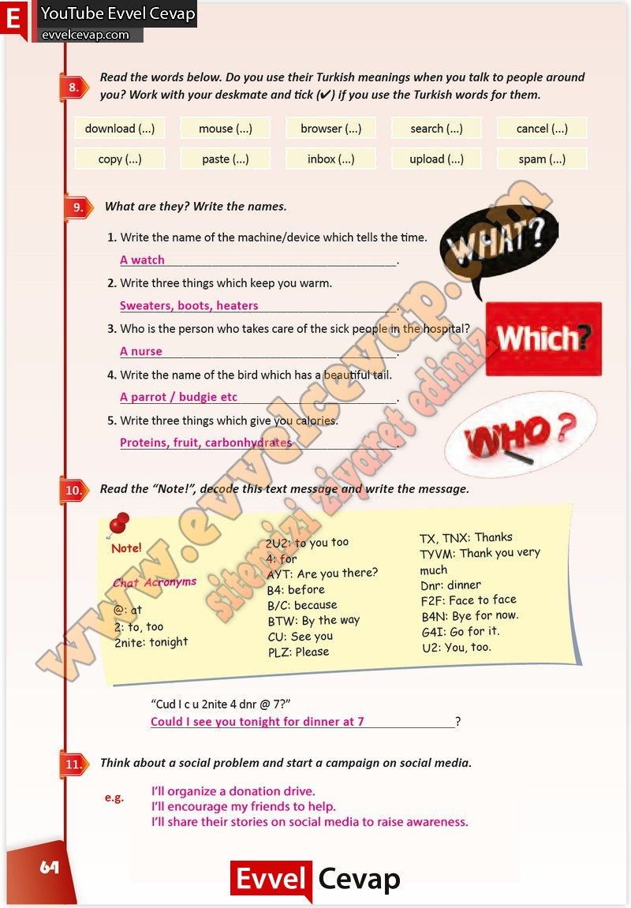

## 10. Sınıf İngilizce Çalışma Kitabı Cevapları Pasifik Yayınları Sayfa 64

**Soru: Read the words below. Do you use their Turkish meanings when you talk to people around you? Work with your deskmate and tick (4) if you use the Turkish words for them.**

**Soru: What are they? Write the names.**

**Soru: Write the name of the machine/device which tells the time.**

**Soru: Write three things which keep you warm.**

**Soru: Who is the person who takes care of the sick people in the hospital?**

**Soru: Write the name of the bird which has a beautiful tail.**

**Soru: Write three things which give you calories.**

**Soru: Read the “Note!”, decode this text message and write the message.**

**Soru: Think about a social problem and start a campaign on social media.**

**10. Sınıf Pasifik Yayınları İngilizce Çalışma Kitabı Sayfa 64**