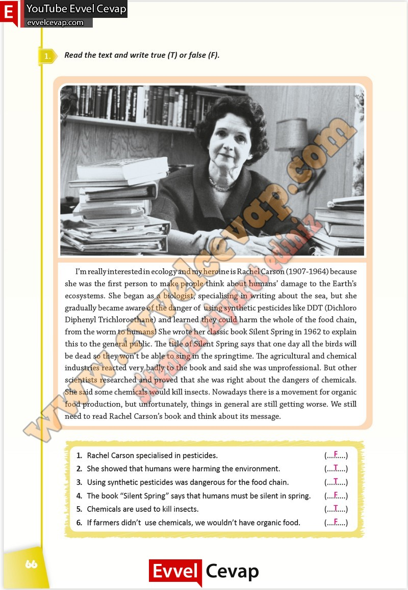

## 10. Sınıf İngilizce Çalışma Kitabı Cevapları Pasifik Yayınları Sayfa 66

**Soru: Read the text and write true (T) or false (F).**

**10. Sınıf Pasifik Yayınları İngilizce Çalışma Kitabı Sayfa 66**