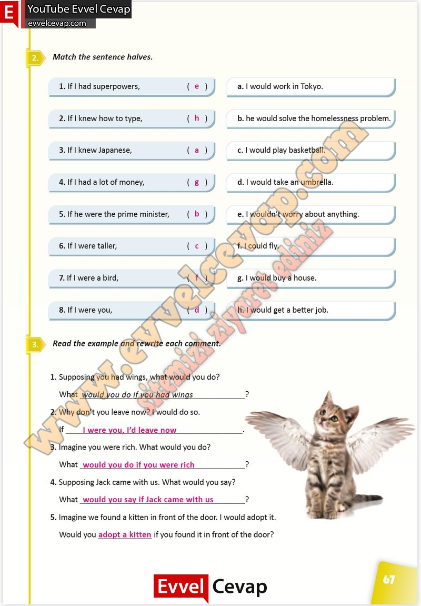

## 10. Sınıf İngilizce Çalışma Kitabı Cevapları Pasifik Yayınları Sayfa 67

**Soru: Match the sentence halves.**

**Soru: Read the example and rewrite each comment.**

**Soru: Supposing you had wings, what would you do?**

**Soru: Why don’t you leave now? I would do so.**

**Soru: Imagine you were rich. What would you do?**

**Soru: Supposing Jack came with us. What would you say?**

**Soru: Would you \_ if you found it in front of the door?**

**10. Sınıf Pasifik Yayınları İngilizce Çalışma Kitabı Sayfa 67**