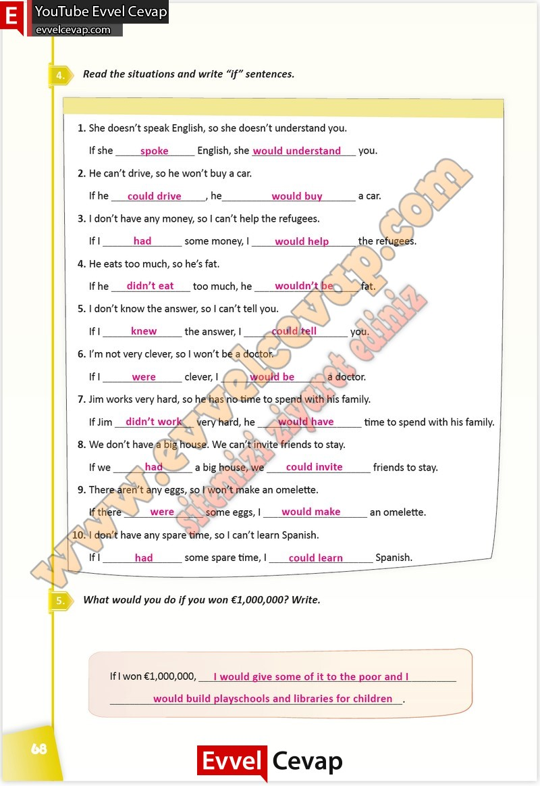

## 10. Sınıf İngilizce Çalışma Kitabı Cevapları Pasifik Yayınları Sayfa 68

**Soru: Read the situations and write “if” sentences.**

**Soru: What would you do if you won €1,000,000? Write.**

**10. Sınıf Pasifik Yayınları İngilizce Çalışma Kitabı Sayfa 68**