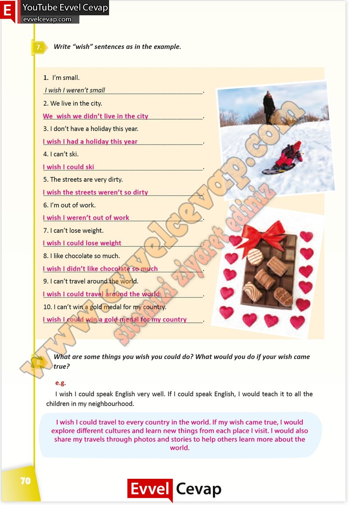

## 10. Sınıf İngilizce Çalışma Kitabı Cevapları Pasifik Yayınları Sayfa 70

**Soru: Write “wish” sentences as in the example.**

**Soru: What are some things you wish you c ould do? What would you do if your wish came true?**

**10. Sınıf Pasifik Yayınları İngilizce Çalışma Kitabı Sayfa 70**