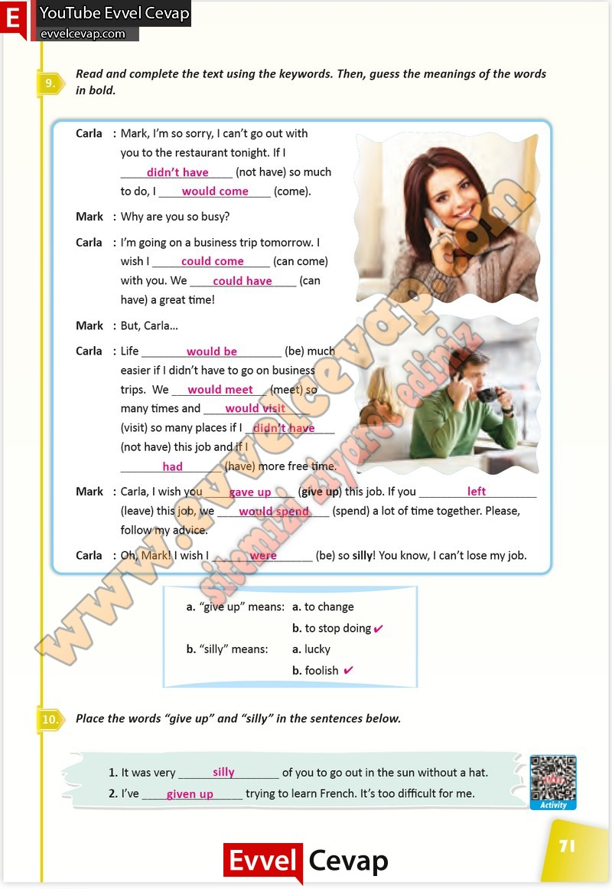

## 10. Sınıf İngilizce Çalışma Kitabı Cevapları Pasifik Yayınları Sayfa 71

**Soru: Read and complete the text using the keywords. Then, guess the meanings of the words in bold.**

**Soru: Place the words “give up” and “silly” in the sentences below.**

**10. Sınıf Pasifik Yayınları İngilizce Çalışma Kitabı Sayfa 71**