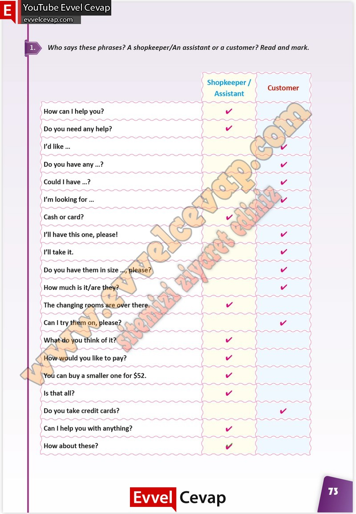

## 10. Sınıf İngilizce Çalışma Kitabı Cevapları Pasifik Yayınları Sayfa 73

**Soru: Who says these phrases? A shopkeeper/An assistant or a customer? Read and mark.**

**10. Sınıf Pasifik Yayınları İngilizce Çalışma Kitabı Sayfa 73**