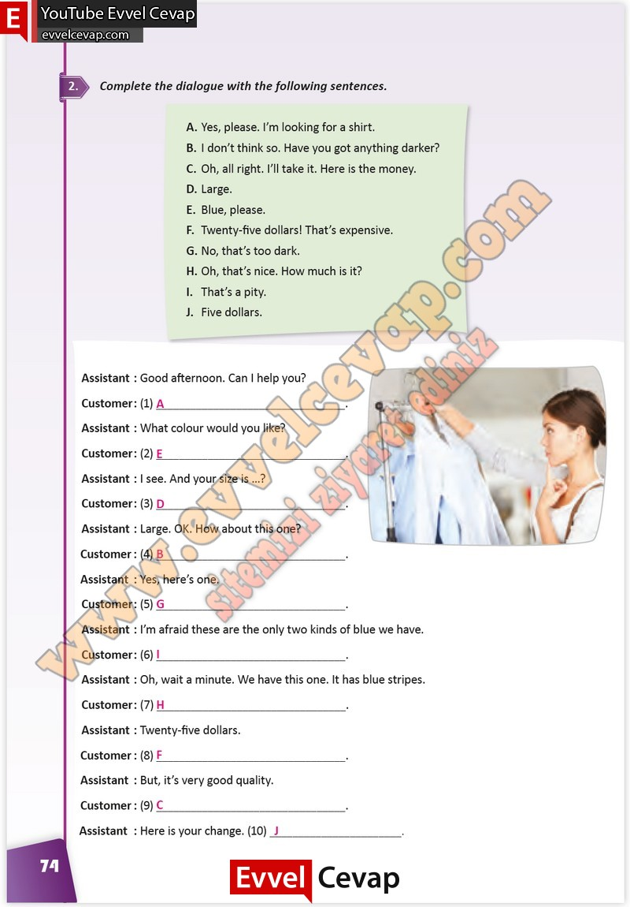

## 10. Sınıf İngilizce Çalışma Kitabı Cevapları Pasifik Yayınları Sayfa 74

**Soru: Complete the dialogue with the following sentences.**

**10. Sınıf Pasifik Yayınları İngilizce Çalışma Kitabı Sayfa 74**