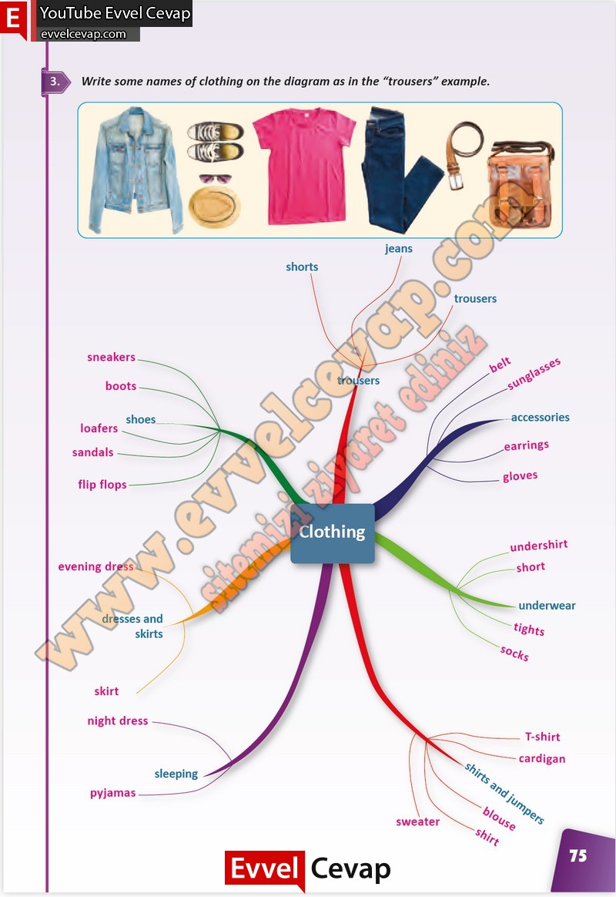

## 10. Sınıf İngilizce Çalışma Kitabı Cevapları Pasifik Yayınları Sayfa 75

**Soru: Write some names of clothing on the diagram as i n the “trousers” example.**

**10. Sınıf Pasifik Yayınları İngilizce Çalışma Kitabı Sayfa 75**