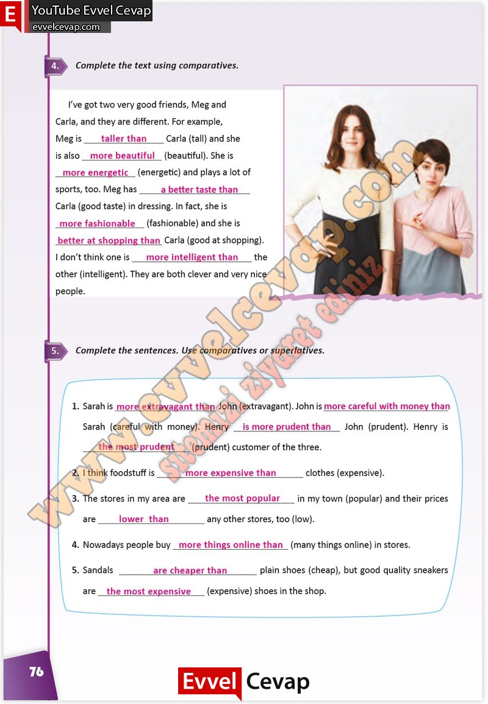

## 10. Sınıf İngilizce Çalışma Kitabı Cevapları Pasifik Yayınları Sayfa 76

**Soru: Complete the text using comparatives.**

**Soru: Complete the sentences. Use comparatives or superlatives.**

**10. Sınıf Pasifik Yayınları İngilizce Çalışma Kitabı Sayfa 76**