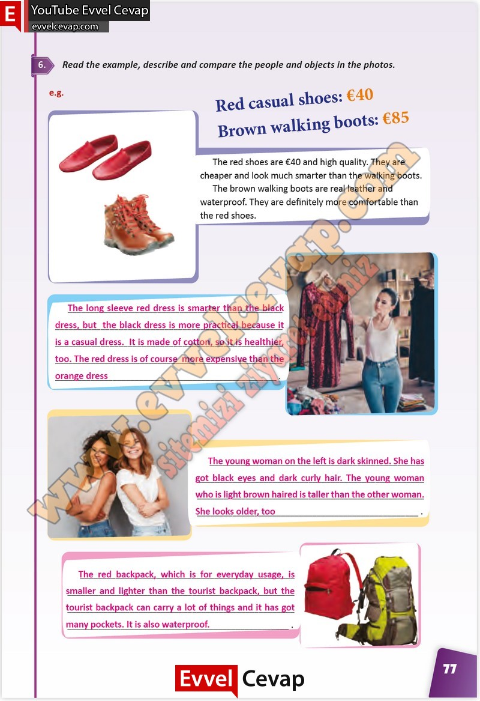

## 10. Sınıf İngilizce Çalışma Kitabı Cevapları Pasifik Yayınları Sayfa 77

**Soru: Read the example, describe and compare the people and objects in the phot os.**

**10. Sınıf Pasifik Yayınları İngilizce Çalışma Kitabı Sayfa 77**