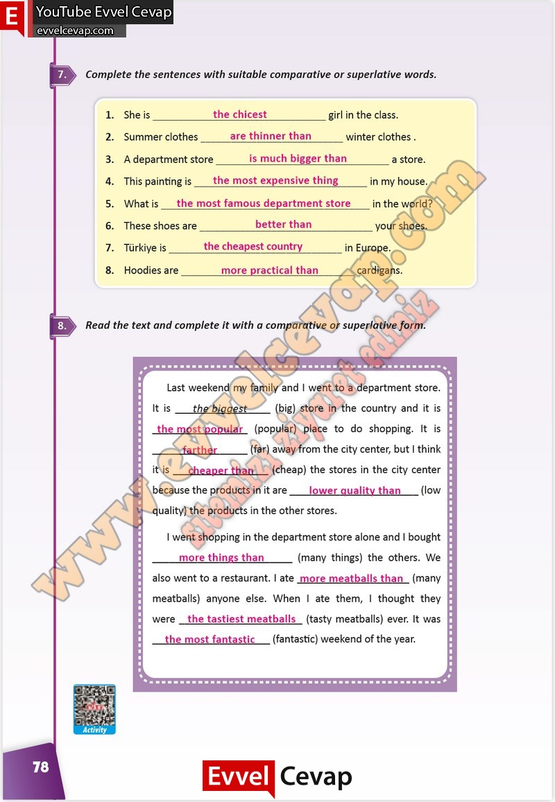

## 10. Sınıf İngilizce Çalışma Kitabı Cevapları Pasifik Yayınları Sayfa 78

**Soru: Complete the sentences with suitable comparative or superlative words.**

**Soru: Read the text and complete it with a comparative or superlative form.**

**10. Sınıf Pasifik Yayınları İngilizce Çalışma Kitabı Sayfa 78**