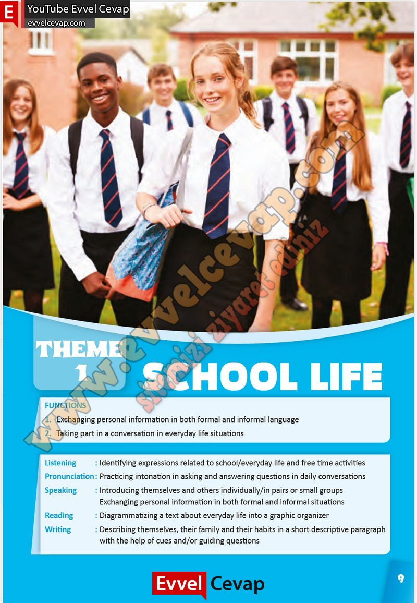

## 10. Sınıf İngilizce Çalışma Kitabı Cevapları Pasifik Yayınları Sayfa 9

1. Exchanging personal information in both formal and informal language  
 2. Taking part in a conversation in everyday life situations  
 Listening : Identifying expressions related to school/everyday life and free time activities  
 Pronunciation : Practicing intonation in asking and answering questions in daily conversations  
 Speaking : Introducing themselves and others individually/in pairs or small groups  
 Exchanging personal information in both formal and informal situations  
 Reading : Diagrammatizing a text about everyday life into a graphic organizer  
 Writing : Describing themselves, their family and their habits in a short descriptive paragraph  
 with the help of cues and/or guiding questions

**10. Sınıf Pasifik Yayınları İngilizce Çalışma Kitabı Sayfa 9**