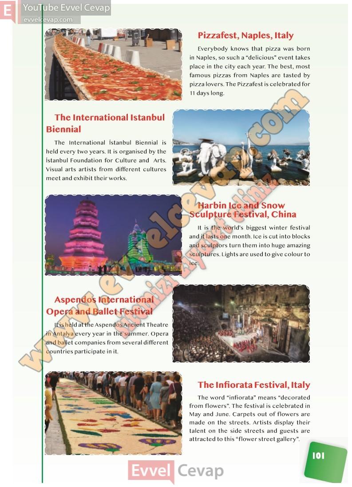

## 10. Sınıf İngilizce Ders Kitabı Cevapları Pasifik Yayınları Sayfa 101

Pizzafest, Naples, Italy  
 Everybody knows that pizza was born in Naples, so such a “delicious” event takes place in the city each year. The best, most famous pizzas from Naples are tasted by pizza lovers. The Pizzafest is celebrated for 11 days long.

The International İstanbul Biennial  
 The International İstanbul Biennial is held every two years. It is organised by the İstanbul Foundation for Culture and Arts. Visual arts artists from different cultures meet and exhibit their works.

Harbin Ice and Snow Sculpture Festival, China  
 It is the world’s biggest winter festival and it lasts one month. Ice is cut into blocks and sculptors turn them into huge amazing sculptures. Lights are used to give colour to ice.

Aspendos International Opera and Ballet Festival  
 It is held at the Aspendos Ancient Theatre in Antalya every year in the summer. Opera and ballet companies from several different countries participate in it.

The Infiorata Festival, Italy  
 The word “infiorata” means “decorated from flowers”. The festival is celebrated in May and June. Carpets out of flowers are made on the streets. Artists display their talent on the side streets and guests are attracted to this “flower street gallery”.

**10. Sınıf Pasifik Yayınları İngilizce Ders Kitabı Sayfa 101**